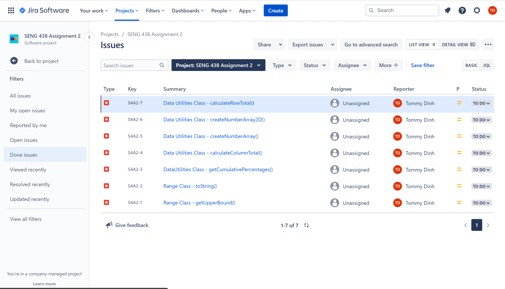

# SENG 438 Winter 2023 Assignment 2

Assignment 2 for Group 13
* Tien Dat Johny Dp
* Tommy Dinh
* Stuart Johnstone
* Sina Tavakol Moghaddam

This repository contains
* Our written lab report
* Our JFreeChart eclipse project containing our RangeTest and DataUtilitiesTest 
* Range class Test Suite alone
* DataUtilities class Test Suite alone
* Testing Plan PDF
* Screenshots of our Jira Bug Reporting
* Lab 2 manual (from cloned repository)
* Note : the external libraries our group has used are within the lib folder, as we could not figure out how to add external libraries to the eclipse project without having errors within the buiild path after re-downloading, but it would be within the JFreeChart folder. 

Source/ Reference : https://softwareengineering.stackexchange.com/questions/340696/how-do-you-use-external-libraries-in-git 

# Appendix A: 
## Jira Overview Page

## Jira Bug view

